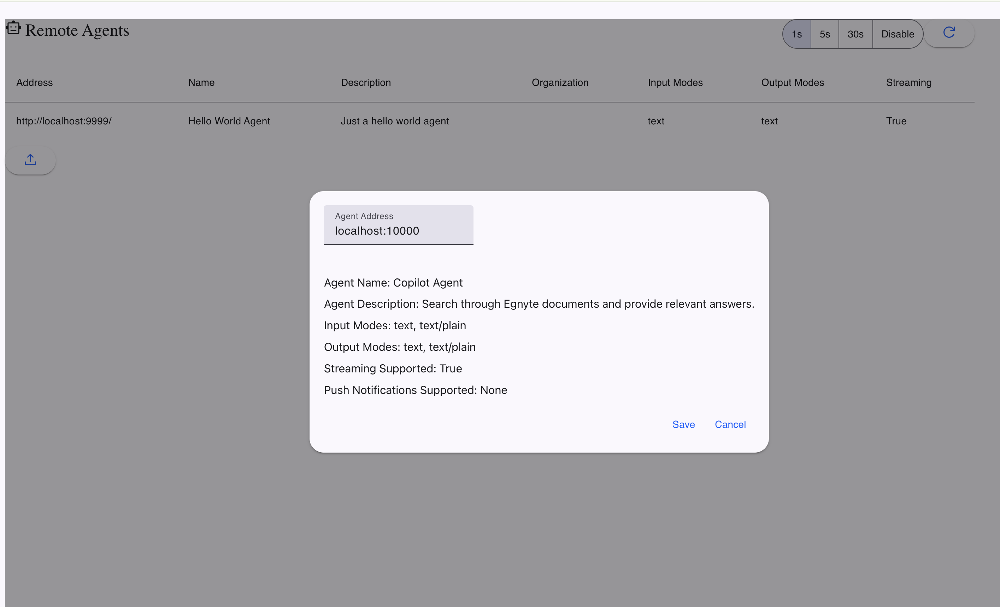
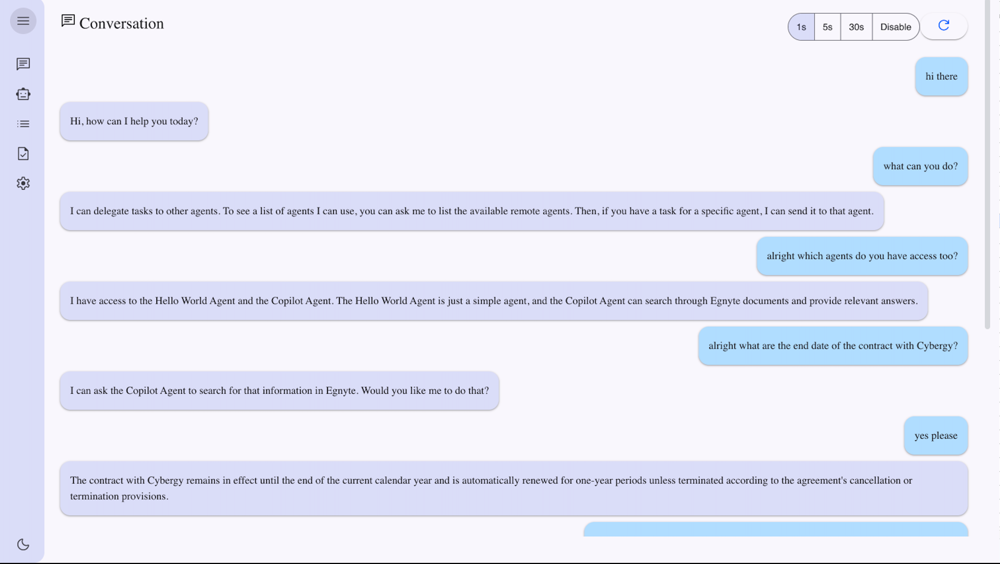

# Egnyte Copilot Agent with A2A Protocol

Egnyte's copilot agent offers secure conversational AI on private enterprise data. Our knowledge bases and copilots can quickly surface insights and summarise documents in large, unstructured datasets.

This repository, based on the [Google's A2A Protocol Repository](https://github.com/google-a2a/a2a-samples/tree/main/samples/python/agents/langgraph) shows how Egnyte’s Copilot Agent can be used in any AI workflow via Egnyte’s public APIs and the A2A protocol. You will be able to

* spin up an Egnyte Copilot Agent with a few lines of Python (using **LangGraph** under the hood)  
* register the agent in a host UI or another agent via its AgentCard  
* chat with the agent, delegate tasks, and stream responses 

Our goal is to illustrate how the A2A protocol enables sophisticated, interactive agents. This implementation uses LangGraph to build a conversational flow that follows the A2A specification.

### Demo screenshots


| Remote-agent registry | Multi-agent chat |
|----------------------|------------------|
|  |  |


---

## Prerequisites

| Requirement | Tested version |
|-------------|---------------|
| **Python** | 3.12+ |
| **uv** package manager | ≥ 0.7 (`pip install uv`) |
| **LLM API key** | OpenAI, Anthropic, Gemini etc. |
| **Egnyte access token** | Create one at <https://developers.egnyte.com/member/register> |
| **Egnyte domain** | e.g. `mycompany.egnyte.com` |

---

## Setup & Running

### 1. Navigate to the samples directory:
    cd samples/python/agents/langgraph

###  2. Create an environment file with your credentials:

##### Set the Google API key

    echo "GOOGLE_API_KEY=your_api_key_here" >> .env
    
##### Set the Egnyte domain e.g. mydomain.egnyte.com

    echo "EGNYTE_DOMAIN=your-egnyte-domain-egnyte.com " >> .env

##### Set the Egnyte access token

    echo "EGNYTE_ACCESS_TOKEN=your_access_token_here" >> .env

### 3. Run the agent (default port 10000):
    . .env
    uv run .


## Use the [WebUI](https://github.com/a2aproject/a2a-samples/tree/main/demo/ui) to access the running agent

```bash
   git clone https://github.com/a2aproject/a2a-samples.git
   cd a2a-samples
```

```bash
  cd demo/ui
```
```bash
  uv sync          # or `npm install` if using the older Next.js UI
```
```bash
  uv run main.py   # serves UI on http://localhost:3000
```
Open http://localhost:3000 in your browser and register agent with http://localhost:10000


## CLI (Command Line Interface)

The CLI is a sample host application that demonstrates the capabilities of an A2AClient. It supports reading a server's AgentCard and text-based collaboration with a remote agent. All content received from the A2A server is printed to the console.

### CLI Prerequisites
- Python 3.12 or higher
- UV
- A running A2A server

### Running the CLI

1. Navigate to the CLI sample directory:
    ```bash
    cd samples/python/hosts/cli
    ```
2. Run the client
    ```
    uv run . 
    ```

### References
1. [A2A](https://github.com/google-a2a/A2A)
2. [Google's A2A Protocol Repository](https://github.com/google-a2a/a2a-samples/tree/main/samples/python/agents/langgraph)
